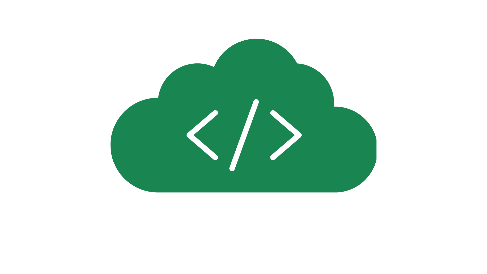

# 🗂️ SwitchBox - Sistema de Almacenamiento en la Nube

 *(Puedes agregar un logo aquí)*

**SwitchBox** es un sistema de almacenamiento en la nube diseñado para gestionar archivos y carpetas de manera eficiente. Con funcionalidades similares a servicios como Google Drive, SwitchBox permite a los usuarios almacenar, organizar y compartir archivos de forma sencilla y segura desde cualquier dispositivo. 🚀

---

## 🌟 Características Principales

### 🛠️ Funcionalidades del Usuario

| **Función**                | **Descripción**                                                                 |
|----------------------------|---------------------------------------------------------------------------------|
| **Registro e Inicio de Sesión** | Los usuarios pueden registrarse e iniciar sesión con su correo y contraseña.    |
| **Subida de Archivos**      | Sube archivos a tu espacio personal o directamente dentro de carpetas.           |
| **Gestión de Carpetas**     | Crea carpetas y subcarpetas para organizar tus archivos de manera jerárquica.    |
| **Compartir Archivos**      | Comparte archivos con otros usuarios mediante su correo electrónico.             |
| **Marcar como Favoritos**   | Marca archivos como favoritos para acceder rápidamente a ellos.                  |
| **Arrastrar y Soltar**      | Arrastra y suelta archivos dentro de carpetas para una organización más intuitiva.|
| **Eliminar y Editar**       | Elimina archivos y carpetas, o edita sus nombres para mantener todo organizado.   |
| **Búsqueda de Archivos**    | Busca archivos rápidamente desde la raíz del sistema.                            |
| **Gestión de Espacio**      | Visualiza el espacio de almacenamiento utilizado y disponible según tu cuenta.   |
| **Edición de Perfil**       | Edita tu información personal, como nombre y correo electrónico.                 |

### 📊 Requerimientos No Funcionales

| **Requerimiento**           | **Detalle**                                                                     |
|----------------------------|---------------------------------------------------------------------------------|
| **Tamaño Máximo de Archivos** | Los archivos no pueden superar los **10 MB**.                                   |
| **Accesibilidad**           | El sistema es accesible desde dispositivos móviles y de escritorio.             |
| **Rendimiento**             | La búsqueda de archivos responde en menos de **2 segundos**.                    |
| **Seguridad**               | Los datos están cifrados para garantizar la seguridad de los archivos.          |
| **Tipos de Cuenta**         | Cuentas gratuitas con **6 GB** y cuentas premium con **12 GB** de espacio.      |

---

## 📖 Historias de Usuario

| **ID** | **Historia de Usuario**                                                                 |
|--------|-----------------------------------------------------------------------------------------|
| 1      | Como usuario no registrado, quiero crear una cuenta para gestionar mis archivos.        |
| 2      | Como usuario registrado, quiero subir archivos para almacenarlos en la nube.            |
| 3      | Como usuario registrado, quiero crear carpetas para organizar mis archivos.             |
| 4      | Como usuario registrado, quiero crear subcarpetas para una organización más jerárquica. |
| 5      | Como usuario registrado, quiero compartir archivos con otros usuarios.                  |
| 6      | Como usuario registrado, quiero marcar archivos como favoritos para acceder rápido.     |
| 7      | Como usuario registrado, quiero arrastrar y soltar archivos dentro de carpetas.         |
| 8      | Como usuario registrado, quiero eliminar archivos para liberar espacio.                 |
| 9      | Como usuario registrado, quiero editar nombres de archivos y carpetas.                  |
| 10     | Como usuario registrado, quiero eliminar carpetas innecesarias.                         |
| 11     | Como usuario registrado, quiero ver mi espacio de almacenamiento utilizado y disponible.|
| 12     | Como usuario registrado, quiero editar mi perfil para cambiar mi información personal.  |
| 13     | Como usuario registrado, quiero buscar archivos rápidamente desde la raíz del sistema.  |

---

## 🏗️ Arquitectura del Proyecto

El proyecto sigue una **Arquitectura Orientada al Dominio (DDD)**, que se enfoca en entender y modelar el negocio antes de implementar la tecnología. Los componentes principales son:

1. **Modelo de Dominio**: Representación del negocio en código.
2. **Lenguaje Común**: Uso de un lenguaje compartido entre el equipo.
3. **Entidades y Valores**: Objetos con identidad (usuarios) y sin identidad (fechas).
4. **Agregados**: Grupos de entidades relacionadas que se manejan como un todo.
5. **Repositorios**: Componentes para guardar y recuperar objetos del sistema.

El flujo de la aplicación es:  
**Entities -> Repositorys -> Services -> ServicesImpl -> Controllers**

---

## 🖼️ Vistas del Sistema

| **Vista**       | **Descripción**                                                                 |
|-----------------|---------------------------------------------------------------------------------|
| **Login**       | Pantalla de inicio de sesión para usuarios registrados.                         |
| **Sign in**     | Pantalla de registro para nuevos usuarios.                                      |
| **Storage-menu**| Menú principal de almacenamiento, donde los usuarios gestionan sus archivos.    |
| **Profile**     | Pantalla de perfil del usuario, donde se puede editar la información personal.  |

---

## 🔗 Enlaces del Proyecto

- **Frontend**: [https://github.com/Adrian-ortiz0/frontend_switchbox](https://github.com/Adrian-ortiz0/frontend_switchbox)
- **Backend**: [https://github.com/Adrian-ortiz0/SwitchBox_MiniSistemaNube](https://github.com/Adrian-ortiz0/SwitchBox_MiniSistemaNube)

---

## 🤝 Cómo Contribuir

¡Tu contribución es bienvenida! Sigue estos pasos:

1. Haz un **fork** del repositorio.
2. Crea una rama para tu contribución:  
   ```bash
   git checkout -b feature/nueva-funcionalidad
Realiza tus cambios y haz commit:

bash
Copy
git commit -m 'Añade nueva funcionalidad'
Haz push a la rama:

bash
Copy
git push origin feature/nueva-funcionalidad
Abre un Pull Request en GitHub.

📜 Licencia
Este proyecto está bajo la licencia MIT. Para más detalles, consulta el archivo LICENSE.